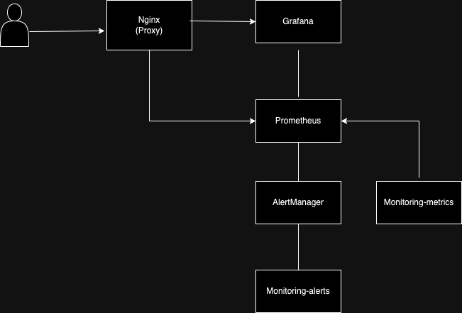

# Monitoring Stack

A comprehensive monitoring solution built with Spring Boot, Prometheus, Grafana, and AlertManager.

## Table of Contents
1. Overview
2. Architecture
3. Components
4. Installation & Setup
5. Configuration
6. Testing
7. Areas for Improvement

## Overview
This monitoring stack provides a comprehensive solution for metrics collection, visualization, and alerting. It combines Spring Boot services for metrics generation and alert handling, Prometheus for metrics collection and storage, Grafana for visualization, and AlertManager for alert management.

## Architecture

The monitoring stack consists of several interconnected components:


### Flow Description
1. monitoring-metrics service generates and exposes application metrics

2. Prometheus scrapes metrics from monitoring-metrics service

3. Grafana queries Prometheus and visualizes the data

4. AlertManager processes alerts based on Prometheus rules

5. monitoring-alerts service receives and processes webhook notifications from AlertManager

6. Nginx acts as a reverse proxy for all components

1. **Monitoring Metrics Service**
   - Spring Boot application that exposes metrics
   - Integrates with Prometheus for metrics collection
   - Uses Micrometer for metrics instrumentation
   - Runs on Java 17

2. **Monitoring Alerts Service**
   - Webhook receiver for AlertManager notifications
   - Handles alert processing and routing
   - Built with Spring Boot validation and aspects
   - Runs on Java 21

3. **Supporting Infrastructure**
   - Prometheus: Collects and stores metrics
   - Grafana: Provides visualization dashboards
   - AlertManager: Handles alert routing and notifications

## Components
1. ### monitoring-metrics (Spring Boot Service)
- Purpose : Metrics generation and exposure
- Port
- Dependencies:
```bash
<dependencies>
    <dependency>
        <groupId>org.springframework.boot</groupId>
        <artifactId>spring-boot-starter-web</artifactId>
    </dependency>
    <dependency>
        <groupId>org.springframework.boot</groupId>
        <artifactId>spring-boot-starter-actuator</artifactId>
    </dependency>
    <dependency>
        <groupId>io.micrometer</groupId>
        <artifactId>micrometer-registry-prometheus</artifactId>
    </dependency>
    <dependency>
        <groupId>org.projectlombok</groupId>
        <artifactId>lombok</artifactId>
    </dependency>
</dependencies>
```
- Key Features :
   - Exposes application metrics via /actuator/prometheus
   - Custom metrics implementation
   - Health checks and system metrics

2. monitoring-alerts (Spring Boot Service)
- Purpose : Alert webhook receiver and processor
- Port : 8081
- Dependencies :
```bash
<dependencies>
    <dependency>
        <groupId>org.springframework.boot</groupId>
        <artifactId>spring-boot-starter-web</artifactId>
    </dependency>
    <dependency>
        <groupId>org.springframework.boot</groupId>
        <artifactId>spring-boot-starter-validation</artifactId>
    </dependency>
    <dependency>
        <groupId>org.springframework</groupId>
        <artifactId>spring-aspects</artifactId>
    </dependency>
    <dependency>
        <groupId>org.projectlombok</groupId>
        <artifactId>lombok</artifactId>
    </dependency>
</dependencies>
```
- Key Features :
   - Webhook endpoint for AlertManager
   - Alert processing and routing
   - Alert persistence (optional)

## Installation & Setup

#### Prerequisites
- Java 21
- Maven
- Docker and Docker Compose

#### Build Instructions
1. Clone the repository
   ```bash
   git clone <repository-url>
   cd monitoring-stack
   ```
2. Build the project:
   ```bash
   mvn clean install
   ```
3. Create necessary directories:
   ```bash
   mkdir -p prometheus/rules grafana/provisioning/{datasources,dashboards} alertmanager
   ```
4. Configure Prometheus to scrape monitoring-metrics:
 ```bash
# prometheus/prometheus.yml
scrape_configs:
  - job_name: 'spring-boot-app'
    metrics_path: '/actuator/prometheus'
    static_configs:
      - targets: ['monitoring-metrics:8080']

   ```
5. Configure AlertManager to send alerts to monitoring-alerts:
```bash
# alertmanager/alertmanager.yml
receivers:
  - name: 'webhook'
    webhook_configs:
      - url: 'http://monitoring-alerts:8081/api/alerts'
 ```
#### Running the Stack
1. Start the entire stack using Docker Compose:
   ```bash
   docker-compose up -d
   ```

This will start the following services:
- Prometheus (metrics collection)
- Grafana (visualization)
- AlertManager (alert handling)
- Monitoring Metrics service
- Monitoring Alerts service

## Configuration
### monitoring-metrics Configuration
   ```bash
   # application.yml
management:
  endpoints:
    web:
      exposure:
        include: health,metrics,prometheus
  metrics:
    tags:
      application: ${spring.application.name}
    enable:
      all: true
   ```
### monitoring-alerts Configuration
   ```bash
   # application.yml
server:
  port: 8081

spring:
  application:
    name: monitoring-alerts

logging:
  level:
    root: INFO
    com.example.monitoring: DEBUG
   ```
## Testing

The project includes a test script (`test-alerts.sh`) that helps verify the alerts functionality:
- Runs against the alerts service endpoint (localhost:8081)
- Allows testing of the webhook receiver functionality
- Useful for verifying alert processing and routing

## Areas for Improvement

1. **Metrics Service Enhancement**
   - Add more custom metrics

   - Implement metric aggregation

   - Add business-specific metrics

   - Implement metric filtering

2. **Alert Service Enhancement**
   - Add alert correlation

   - Implement alert deduplication

   - Add alert prioritization

   - Create alert escalation policies

   - Implement alert acknowledgment system

3. **Security**
   - Implement authentication for services
   - Add HTTPS support
   - Secure metrics endpoints

4. **Observability**
   - Add tracing support
   - Enhance logging
   - Include more detailed metrics

5. **Containerization**
   - Optimize Docker images
   - Add Kubernetes deployment manifests
   - Implement health checks


## Contributing
Please read CONTRIBUTING.md for details on our code of conduct and the process for submitting pull requests.

## License
This project is licensed under the MIT License - see the LICENSE file for details.

